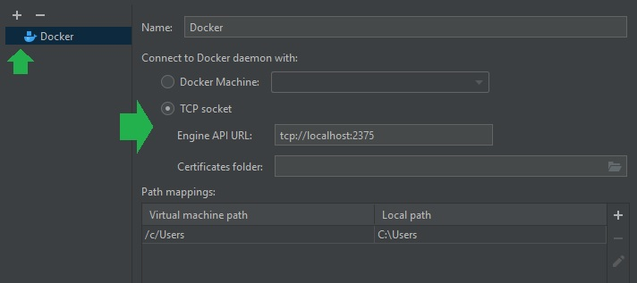

# Python + Docker + PyCharm

## Getting started
1. Download and install git scm
2. Download and install Docker Desktop
3. Download, install, and activate PyCharm Pro

## Create the project in GitHub
1. Set up new repo "python-docker-pycharm"
2. Add README.md and .gitignore, no LICENSE

## Launch PyCharm and open project
1. Go to VCS, Get from version control, paste the url, and Clone
2. Examine the folder structure that was cloned
3. Verify the 4 instructions in the Dockerfile
4. Verify the contents of src/my_script.py

## Set up connection to Docker
1. Go to Settings, Build..., Docker
2. Add a Docker, verify localhost and port is set
3. Click Apply

## Add Run Configuration
1. Add Configuration...
2. Click +, Docker, Dockerfile
3. Give the configuration a name and an image tag
4. Specify the Dockerfile and confirm 'Run built image' is checked
5. Click Apply

